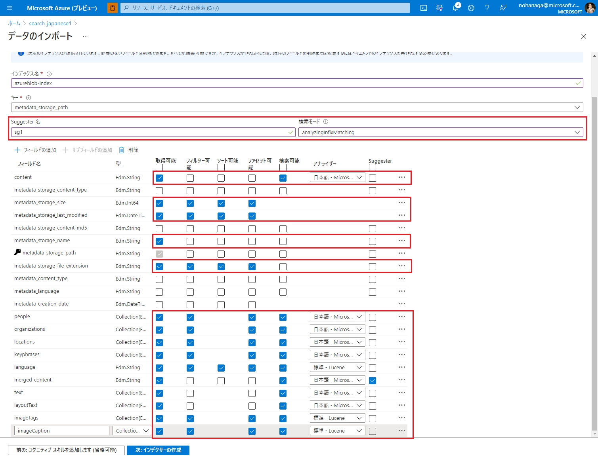
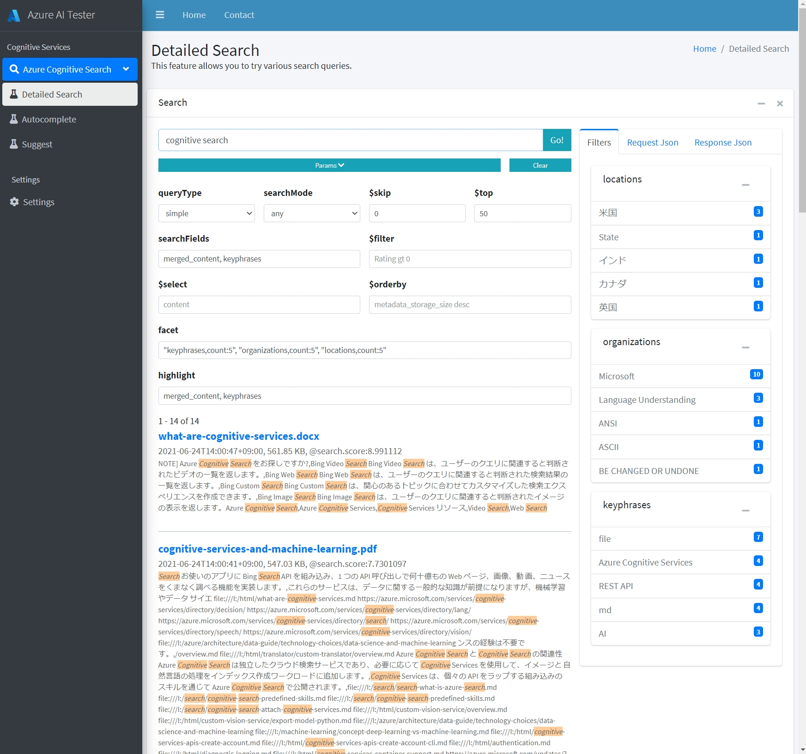
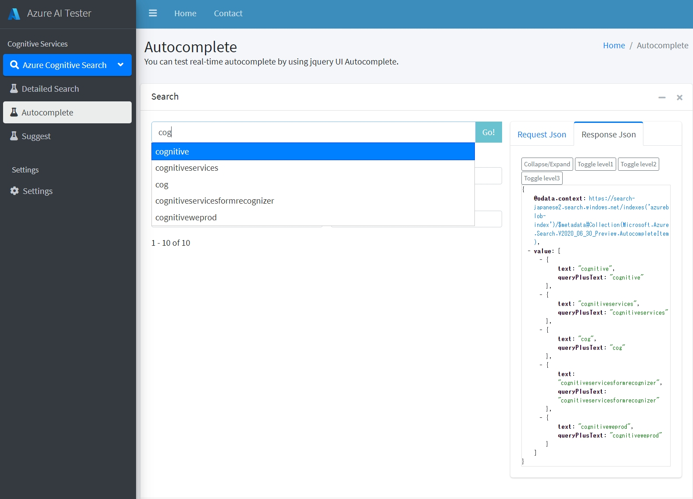
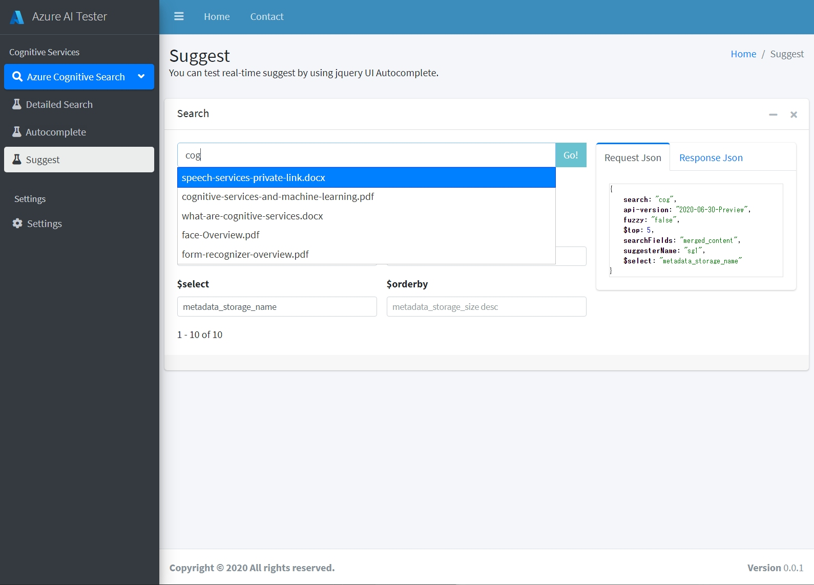
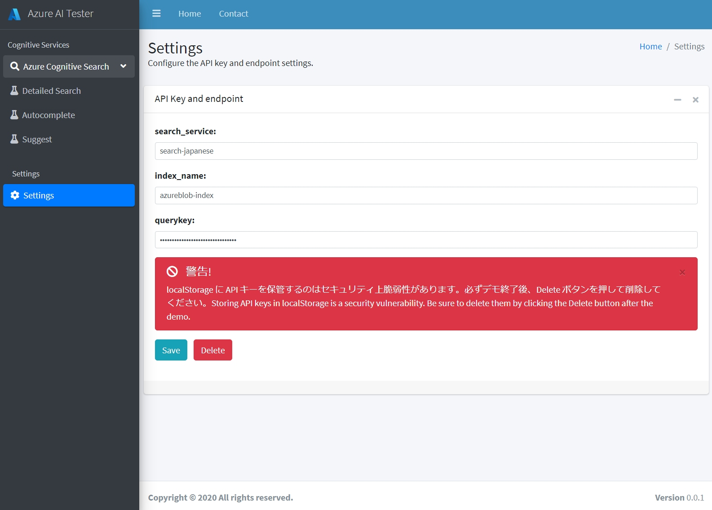

# Simple-Cognitive-Search-Tester
Simple Cognitive Search Tester は、本当にシンプルなフル HTML の Azure Cognitive Search 用のクエリーテスターです。
これは [Azure-Cognitive-Search-Workshop](https://github.com/nohanaga/Azure-Cognitive-Search-Workshop) のための検索 UI として、また、製品のデモやクエリーテストのために開発されました。そして私が開発を進めている、Azure AI Tester の一部でもあります。

# Usage
ダウンロードして、index.html をブラウザで起動するだけ。とってもシンプルでしょ？インストール作業は一切必要ありません。

# 前提条件

## 1. 必要なインデックスフィールド
Azure Cognitive Search のインデックスフィールドは、[Azure-Cognitive-Search-Workshop](https://github.com/nohanaga/Azure-Cognitive-Search-Workshop) の[演習1](https://github.com/nohanaga/Azure-Cognitive-Search-Workshop/blob/main/CreateIndex.md) もしくは [演習2](https://github.com/nohanaga/Azure-Cognitive-Search-Workshop/blob/main/UsingPostman.md) にしたがって作成してください。[演習2](https://github.com/nohanaga/Azure-Cognitive-Search-Workshop/blob/main/UsingPostman.md) の Postman API コレクションを使えば、画像とまったく同じインデックスがすぐに作れます。



## 2. merged_content が必要です
Simple Cognitive Search Tester はデフォルトで、`merged_content` を表示するように設定してあります。これを `content` など他の本文に変更したい場合は、`index.html` の Line:550 あたりのコードをお望みの本文フィールド名に置換してください。

```javascript
var mergedContent = element['merged_content']
```

# 機能

## 1. Detailed Search
詳細検索では、Azure Cogntive Search の多くの検索クエリーを試すことができます。

- queryType
    - Simple Query parser
    - Full Lucene Query parser
- searchMode
    - all
    - any
- $skip
- $top
- searchFields
- $filter
- $select
- $orderby
- facet
- highlight




## 2. Autocomplete
実際にオートコンプリート機能を jquery UI Autocomplete を使って試すことができます。

- autocompleteMode
    - oneTerm
    - twoTerms
    - oneTermWithContext
- fuzzy
- suggesterName
- $top
- searchFields
- $filter



## 3. Suggest
実際にサジェスト機能を jquery UI Autocomplete を使って試すことができます。

- fuzzy
- suggesterName
- $top
- searchFields
- $filter
- $select
- $orderby



## 4. Settings
APIキーやエンドポイントの設定をします。
検索クエリの実行に必要な、以下の情報を入力して「Save」をクリックします。入力した接続情報は、ブラウザの localStorage に保存されます。

- search_service: Azure Cognitive Search サービスリソースの名前。検索対象の検索サービス名を設定します。
- index_name: 検索インデックスの名前。検索対象のインデックス名を指定します。
- querykey: Azure Cognitive Search サービスの API キー。検索クエリ用途のみですので、クエリキーのほうを使用します。これは [Azure Portal](https://portal.azure.com/) の検索サービスの「設定メニュ→キー」からコピーします。

注意：localStorage に API キーを保管するのはセキュリティ上脆弱性があります。今回一時的な使用のためだけに用意しています。必ずデモ終了後、Delete ボタンを押して削除してください。localStorage に API キーを保管したくない方は、各検索 html ページのソースコードの接続情報変数を直接編集してください。



# 利用条件
本 HTML GUI(Simple Cognitive Search Tester) はテスト、ハンズオン目的のみ使用できます。作成者は利用者に対して、いかなる種類の（明示的または黙示的な）保証もせず、責任、義務を一切負いません。


