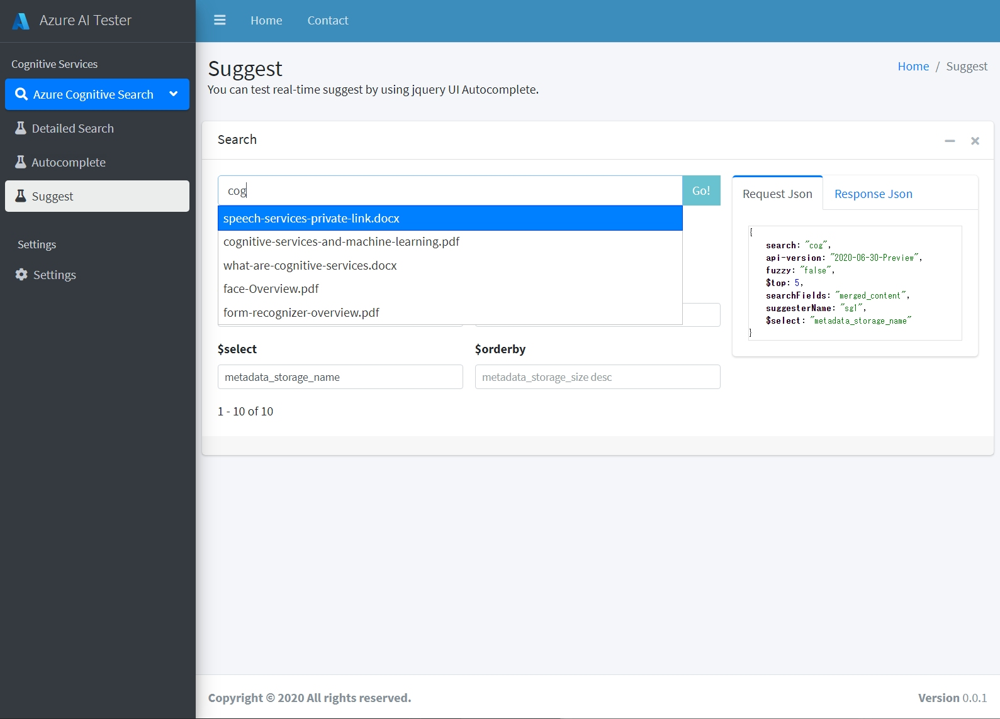

# Simple-Cognitive-Search-Tester
Simple Cognitive Search Tester is a really simple full HTML query-tester for Azure Cognitive Search.
It was developed as a search UI for [Azure-Cognitive-Search-Workshop](https://github.com/nohanaga/Azure-Cognitive-Search-Workshop), as well as for product demos and query-testing.
It's also part of the Azure AI Tester I'm developing.

[日本語](README.jp.md)はこちら

# Usage
Download and launch index.html in your browser.
Very simple, right? No installation required.

# Prerequisites

## 1. Required index fields
The Azure Cognitive Search index fields should be created according to the [Azure-Cognitive-Search-Workshop](https://github.com/nohanaga/Azure-Cognitive-Search-Workshop) exercises 1 or 2. Using the Postman API collection from [Exercise 2](https://github.com/nohanaga/Azure-Cognitive-Search-Workshop/blob/main/UsingPostman.md), you can quickly create an index exactly like the image.


## 2. merged_content is required
Simple Cognitive Search Tester is configured to display `merged_content` by default. If you want to change it to `content` or some other content text, replace the code around Line:550 in `index.html` with the content field name you want.

```javascript
var mergedContent = element['merged_content']
```


# Features

## 1. Detailed Search
In Detailed Search, you can try many search queries in Azure Cogntive Search.

- queryType
    - Simple Query parser
    - Full Lucene Query parser
- searchMode
    - all
    - any
- $skip
- $top
- searchFields
- $filter
- $select
- $orderby
- facet
- highlight


## 2. Autocomplete
You can test real-time autocomplete by using jquery UI Autocomplete.

- autocompleteMode
    - oneTerm
    - twoTerms
    - oneTermWithContext
- fuzzy
- suggesterName
- $top
- searchFields
- $filter


## 3. Suggest
You can test real-time suggest by using jquery UI Autocomplete.

- fuzzy
- suggesterName
- $top
- searchFields
- $filter
- $select
- $orderby



## 4. Settings
Configure the API key and endpoint settings.
Enter the following information required to execute the search query, and click "Save". The connection information you entered will be saved in the localStorage of your browser.

- search_service: Name of the Azure Cognitive Search service resource. Enter the name of the search service.

- index_name: Name of the search index. Enter the name of the index you want to search.

- querykey: API key of Azure Cognitive Search service. Since it is only for a search query, use the query key. This can be copied from "Settings menu -> Key" of the search service in [Azure Portal](https://portal.azure.com/).

Note: Storing the API key in localStorage is a security vulnerability. It is provided for temporary use only. If you do not want to store your API key in localStorage, you can directly edit the connection information variable in the source code of each html page.


# Terms of Use
This HTML GUI (Simple Cognitive Search Tester) can be used for test and hands-on purposes only. The author makes no warranty of any kind (explicit or implied) and assumes no responsibility or liability to the user.


