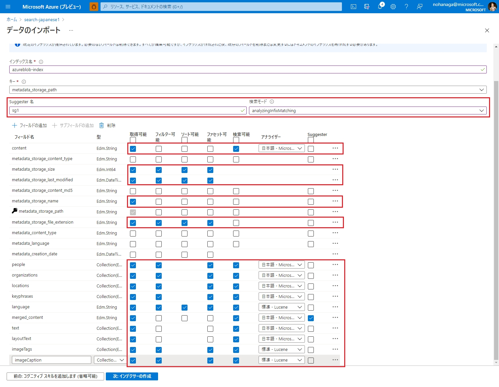
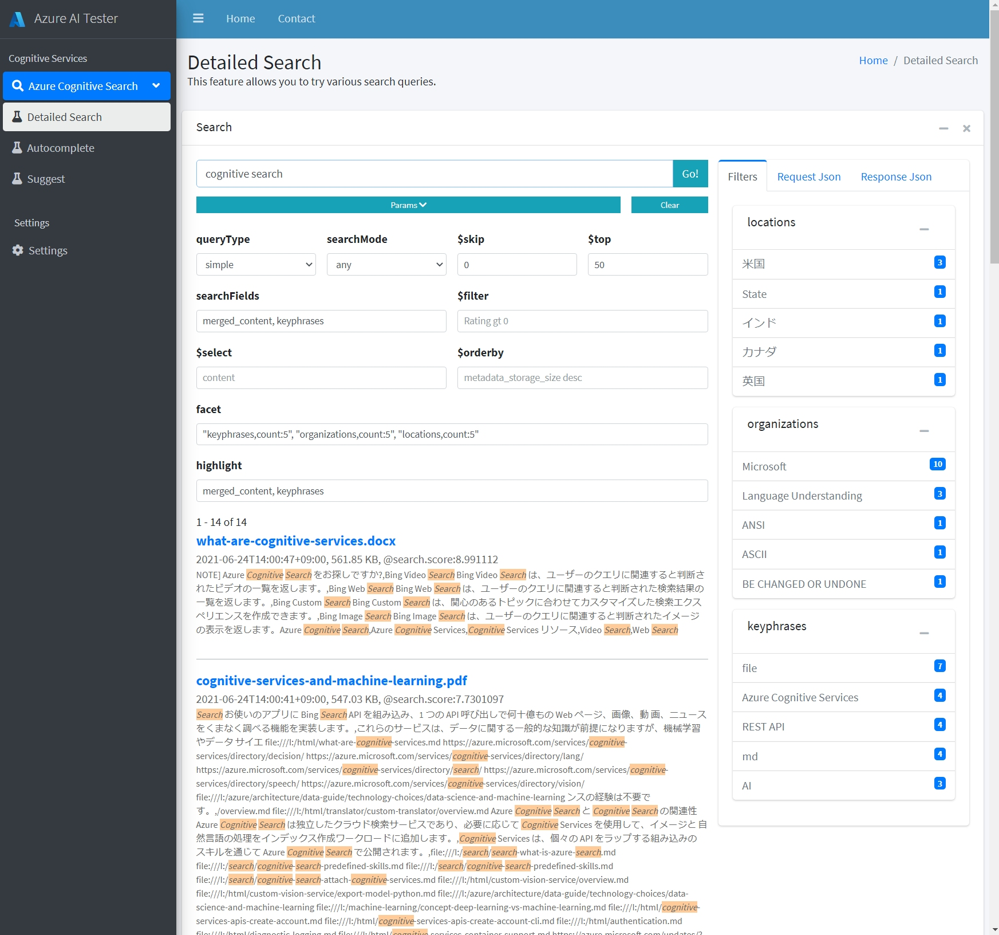
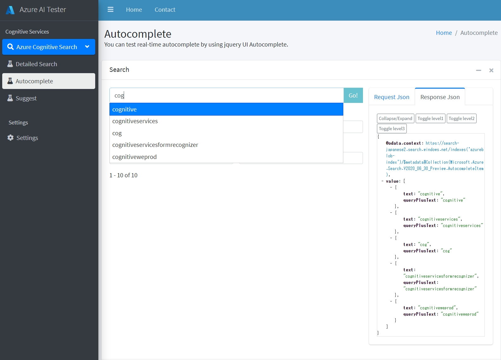

# Simple-Cognitive-Search-Tester
Simple Cognitive Search Tester は、本当にシンプルなフル HTML の Azure Cognitive Search 用のクエリーテスターです。
これは [Azure-Cognitive-Search-Workshop](https://github.com/nohanaga/Azure-Cognitive-Search-Workshop) のための検索 UI として、また、製品のデモやクエリーテストのために開発されました。
私が開発を進めている、Azure AI Tester の一部でもあります。

Simple Cognitive Search Tester is a really simple full HTML query-tester for Azure Cognitive Search.
It was developed as a search UI for [Azure-Cognitive-Search-Workshop](https://github.com/nohanaga/Azure-Cognitive-Search-Workshop), as well as for product demos and query-testing.
It's also part of the Azure AI Tester I'm developing.

# Usage
ダウンロードして、index.html をブラウザで起動するだけ。
とてもシンプルでしょ？インストール作業は一切必要ありません。

Download and launch index.html in your browser.
Very simple, right? No installation required.

# Prerequisites
Azure Cognitive Search のインデックスフィールドは、[Azure-Cognitive-Search-Workshop](https://github.com/nohanaga/Azure-Cognitive-Search-Workshop) の演習1 or 2 にしたがって作成してください。[演習2](https://github.com/nohanaga/Azure-Cognitive-Search-Workshop/blob/main/UsingPostman.md) の Postman API コレクションを使えば、画像とまったく同じインデックスがすぐに作れます。

The Azure Cognitive Search index fields should be created according to the [Azure-Cognitive-Search-Workshop](https://github.com/nohanaga/Azure-Cognitive-Search-Workshop) exercises 1 or 2. Using the Postman API collection from [Exercise 2](https://github.com/nohanaga/Azure-Cognitive-Search-Workshop/blob/main/UsingPostman.md), you can quickly create an index exactly like the image.

# Features

## 1. Detailed Search
詳細検索では、Azure Cogntive Search の多くの検索クエリーを試すことができます。
In Detailed Search, you can try many search queries in Azure Cogntive Search.

- queryType
    - Simple Query parser
    - Full Lucene Query parser
- searchMode
    - all
    - any
- $skip
- $top
- searchFields
- $filter
- $select
- $orderby
- facet
- highlight

## 2. Autocomplete
実際にオートコンプリート機能を jquery UI Autocomplete を使って試すことができます。
You can test real-time autocomplete by using jquery UI Autocomplete.

## 3. Suggest
実際にサジェスト機能を jquery UI Autocomplete を使って試すことができます。
You can test real-time suggest by using jquery UI Autocomplete.

## 4. Settings
APIキーやエンドポイントの設定をします。
検索クエリの実行に必要な、以下の情報を入力して「Save」をクリックします。入力した接続情報は、ブラウザの localStorage に保存されます。

- search_service: Azure Cognitive Search サービスリソースの名前。検索対象の検索サービス名を設定します。
- index_name: 検索インデックスの名前。検索対象のインデックス名を指定します。
- querykey: Azure Cognitive Search サービスの API キー。検索クエリ用途のみですので、クエリキーのほうを使用します。これは [Azure Portal](https://portal.azure.com/) の検索サービスの「設定メニュ→キー」からコピーします。

注意：localStorage に API キーを保管するのはセキュリティ上問題があります。今回一時的な使用のためだけに用意しています。必ずデモ終了後、Delete ボタンを押して削除してください。localStorage に API キーを保管したくない方は、各検索 html ページのソースコードの接続情報変数を直接編集してください。

Configure the API key and endpoint settings.
Enter the following information required to execute the search query, and click "Save". The connection information you entered will be saved in the localStorage of your browser.

- search_service: Name of the Azure Cognitive Search service resource. Enter the name of the search service.

- index_name: Name of the search index. Enter the name of the index you want to search.

- querykey: API key of Azure Cognitive Search service. Since it is only for a search query, use the query key. This can be copied from "Settings menu -> Key" of the search service in [Azure Portal](https://portal.azure.com/).

Note: Storing the API key in localStorage is a security vulnerability. It is provided for temporary use only. If you do not want to store your API key in localStorage, you can directly edit the connection information variable in the source code of each html page.

# Terms of Use
本 HTML GUI(Simple Cognitive Search Tester) はテスト、ハンズオン目的のみ使用できます。作成者は利用者に対して、いかなる種類の（明示的または黙示的な）保証もせず、責任、義務を一切負いません。

This HTML GUI (Simple Cognitive Search Tester) can be used for test and hands-on purposes only. The author makes no warranty of any kind (explicit or implied) and assumes no responsibility or liability to the user.

